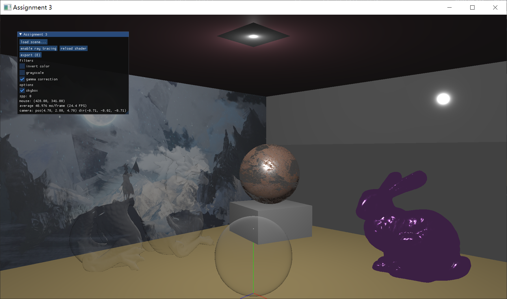
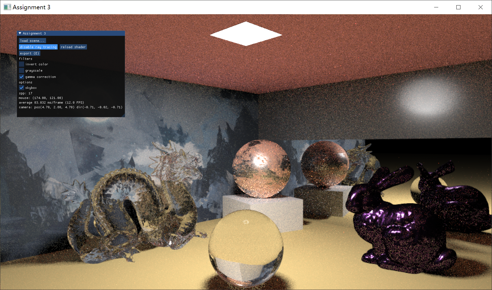
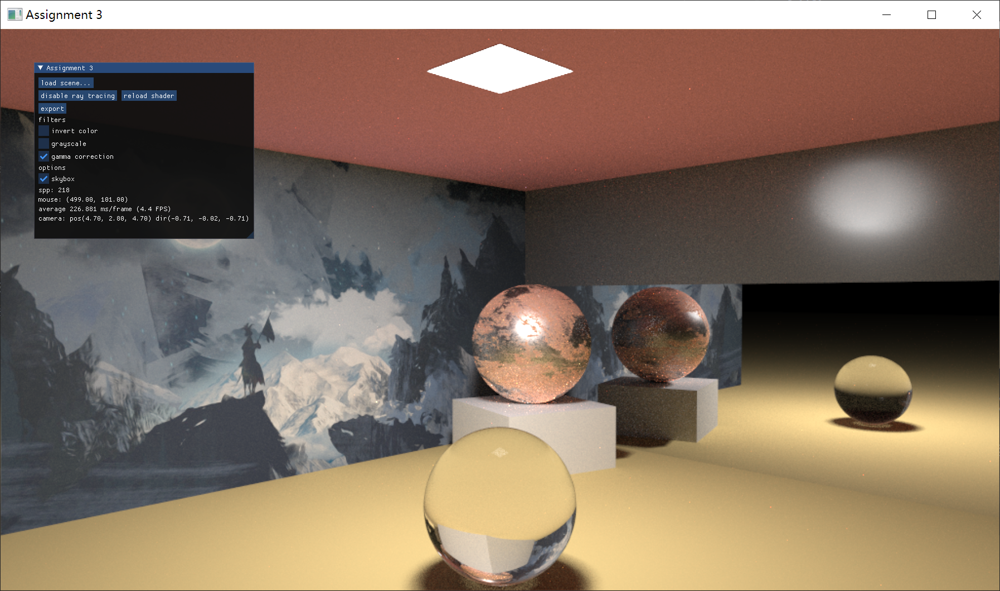
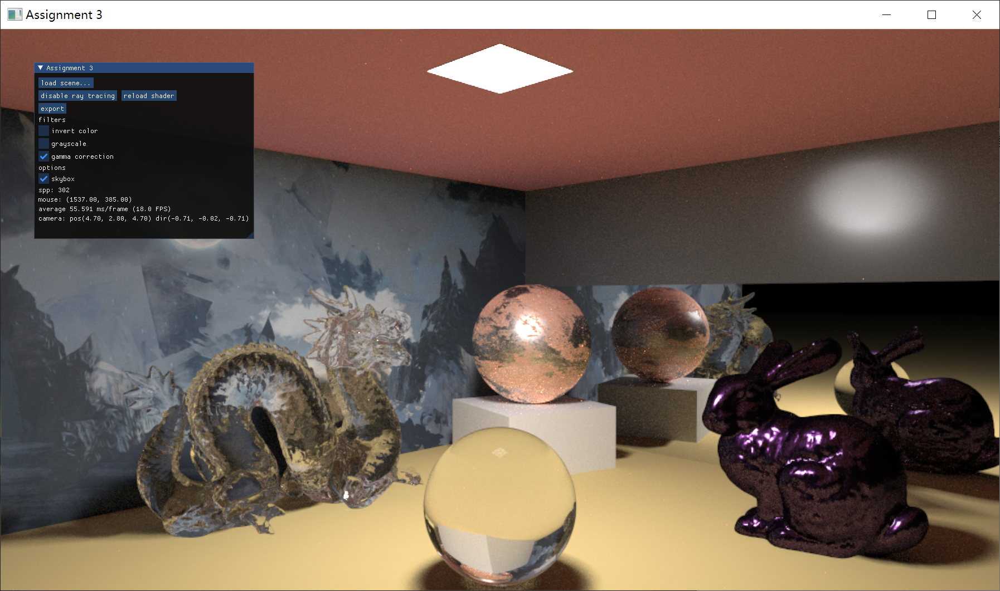

# 计算机图形学基础 作业3


## 测试环境

Windows 10 x64 10.0.19041.1151  (NVIDIA GeForce RTX 2080Ti 11GB) 
macOS Big Sur 11.3 (AMD Radeon Pro 5500M 8GB)

OpenGL 4.1 (core profile) 
OpenCL 1.2

## 编译与运行

使用 CMake 构建。

在以下平台测试编译运行过

- Windows 10 Visual Studio 2019 16.11.5 MSVC 14.29.30133
- Windows 10 g++ 11.2.0 (winlibs)
- macOS 11.3 clang 12.0.0

可以通过命令行指定一些运行参数，例如
```shell
assignment.exe cpu w1920 h1080
```
- `cpu` 可选，表示光追使用 CPU 渲染，否则为 OpenCL 渲染
- `wXXX` `hXXX` 可选，必须同时指定或不指定，表示光追的渲染分辨率。默认为 1024x576


如果需要编译一个不依赖 OpenCL 的版本，可以在 CMake 参数中添加 `-DNO_CL=true`。在此版本下，不论是否使用 `cpu` 命令行参数启动，均会使用 cpu 渲染。
### 依赖库

- `glad`, `glfw`, `glm` 基础库
- `cl.hpp` OpenCL 的 C++ Wrapper
- `tinydialog` 跨平台的 native 文件打开对话框
- `nlohmann/json` json 序列化与反序列化
- `imgui` GUI 组件
- `stb_image` 图像加载
- `assimp` 资源加载

## 功能与实现

在两次作业中实现了一个简易的图形框架，支持：

- 对象层级结构
- 材质 (Blinn-Phong 和 Cock-Torrance)
- 三角形网格

并进行了一定的封装。代码见 `lib` 目录

并通过 OpenCL 实现了一个简单的路径追踪器，代码见 `lib/shaders/raytracing.cpp` (同时是 C++ 和 OpenCL 程序) 和 `lib/raytracing/rt.cpp` (C++ Wrapper)。也可以使用纯 CPU 渲染，在启动命令行中添加 `cpu` 即可。 CPU 渲染通过 `include/simcl.h` 模拟 OpenCL 的库函数。

主程序位于 `src/appmain.cpp`

### 控制

- 按住 ALT 键移动鼠标旋转视角
    - 使用上下左右键也可以旋转视角
- WASD 控制相机水平移动，Q 向上移动，E 向下移动
- 窗口可以调整大小 (光追模式下，窗口大小调整不会影响渲染目标分辨率)
- 左上角的面板中，filters 下有三个后处理器可以开关
    - `invert color` 反相
    - `grayscale` 灰度
    - `gamma correction` 伽马校正 (默认开启)
- `skybox` 开关控制天空盒是否显示
- `export (E)` 将路径追踪的图像输出到 `output.png` 文件
  - 也可以按 E 键作为替代：当帧数很低的时候，ImGui 会[检测不到点击](https://github.com/ocornut/imgui/issues/4592)
  - 反相和灰度效果不会被作用于输出
  - 伽马校正会被作用于输出

### 场景加载

可以加载自定义的 json 格式场景

```jsonc
{
  "materials": [              // 所有材质
    {
      "id": "mtl-ball",       // 材质的 ID，会被物体引用
      "type": "standard",
      "albedo": { "texture": "material/rustediron2/rustediron2_basecolor.png" },
      "metallic": { "texture": "material/rustediron2/rustediron2_metallic.png" },
      "roughness": { "texture": "material/rustediron2/rustediron2_roughness.png" }
    },
    // ...
  ],
  "objects": [                // 所有物体
    {
      "id": "ball1",
      "geometry": {           // 几何信息
        "type": "sphere",     // 支持 "box", "sphere", "plane" 和 "file"
        "radius": 1.0
      },
      "position": [3.0, 1.0, -2.0],
      "material": "mtl-ball"  // 引用的材质 ID，或材质信息结构体
    },
    {
      "id": "bunny",
      "geometry": {
        "type": "file",       // 从文件读取几何信息
        "file": "object/bun_zipper_res2.ply"
      },
      "position": [-2.0, 0.0, -2.0],
      "scale": [10.0, 10.0, 10.0],
      "material": "mtl-bunny"
    },
    {
      "id": "light",
      "isLight": true,        // 标记 isLight 的物体会在路径追踪时被作为光源处理
      "position": [0.0, 5.0, 0.0],
      "geometry": {
        "type": "plane",
        "size": [0.5, 0.5]
      },
      "material": "mtl-light"
    },
    // ...
  ]
}
```

在程序中，通过左上方 `load_scene...` 按钮选择场景文件进行加载。

json 读取使用 `nlohmann` 库，ply 读取使用 `assimp` 库。实现见 `lib/imported/obj_loader.cpp`。

### 滤镜

基于 FBO 实现了反相和灰度滤镜。

### 局部光照明模型



点击左上角的 "load scene..." 加载场景。实际使用的场景见 `assets/scene/scene.json`。

局部光照明使用 Cock-Torrance 模型。实现见 `lib/shaders/standard.vsh` 和 lib/shaders/standard.fsh`，使用 albedo/metallic/roughness 工作流。

图中上方的正方形处是点光源。

### 路径追踪
路径追踪的实现见 `lib/shaders/raytracing.cpp` (同时是 cpp 代码和 OpenCL 代码)。



点击左上角的 "enable ray tracing" 开启光线追踪。

实现了基于蒙特卡洛积分方法的路径追踪器，采用 Disney BSDF 光照模型，即分解为 Diffuse BRDF, Specular BRDF 和 Specular BSDF 三部分进行计算，通过一个启发式的概率函数在三种传播间随机选择。

文档开头的图片使用 OpenCL 在 NVIDIA RTX 2080Ti 上渲染，场景共 871,414 个三角形，分辨率 3840x2160，40000 spp，1 spp 的计算大约需要 1050ms。

最大允许十次光线弹射，使用俄罗斯轮盘赌控制终止。射线方向采用光源采样和 Cosine-weighted Hemisphere Sampling。本节开头的图片，因为有光源采样，在 17 spp 下也能看到一个较为明亮的场景。

只要不移动视角，spp 就会不断积累。点击 `reload shader` 可以重新加载 `lib/shaders/raytracing.cpp` 中的 OpenCL 程序。(对于 CPU 渲染，这一操作无效)

贴图通过将像素按 row-major 展开为一维向量传入 OpenCL，采样使用双线性插值，即采集采样点附近的四个像素的颜色插值，贴图边缘 wrapping。

### 相交检测和加速结构

加速结构采用了 BVH，基于轴对其包围盒的最长轴进行分割。

线与三角形相交使用 Möller-Trumbore 算法，参考 [Ray Tracing: Rendering a Triangle](https://www.scratchapixel.com/lessons/3d-basic-rendering/ray-tracing-rendering-a-triangle/moller-trumbore-ray-triangle-intersection) 的实现。

#### 性能对比
CPU 渲染使用 Ryzen R9 5900X，16 线程并行  
GPU 渲染使用 NVIDIA GeForce RTX 2080Ti  
simple 场景有 4,950 个三角形，complex 场景有 871,414 个三角形

每个 spp 用时

| 场景    | CPU   | OpenCL(GPU) |
|:------:|:-----:|:-----------:|
| simple | <br/>227ms |<br/> 21ms |
| complex| <br/>559ms |<br/> 56ms |

由于 CPU 和 OpenCL 两者使用同一份 codebase，故渲染效果上并无区别，但性能上有约 10 倍的差异。

可以注意到，虽然两个场景有 176 倍的三角形数量差异，但复杂场景的用时只是简单场景的约 2.5 倍，可以认为 BVH 加速起到了明显的效果。
