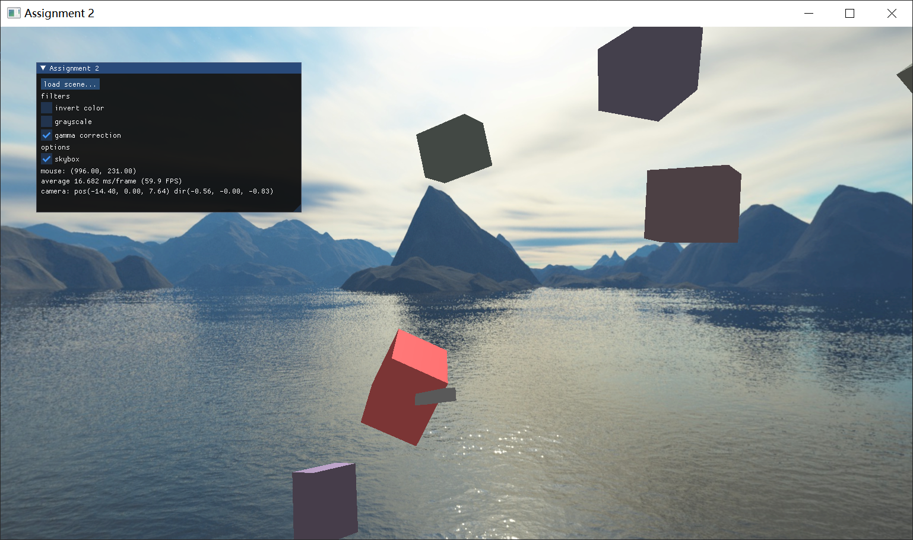
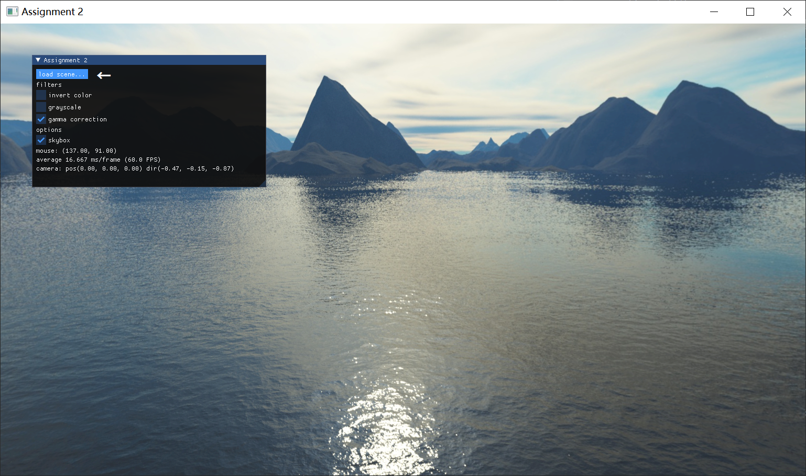

# 计算机图形学基础 作业2

## 测试环境
Windows 10 x64 10.0.19041.1151  (NVIDIA GTX 1660 Super 6GB)  
macOS Big Sur 11.3 (AMD Radeon Pro 5500M 8GB)  
OpenGL 3.3 (core profile)

## 编译与运行
使用 CMake 构建。  
CMakeLists.txt 修改自 LearnOpenGL 系列教程。

在以下平台测试编译运行过
- Windows 10 MSVC 14.27.29110
- macOS 11.3 clang 12.0.0

### 依赖库
- `glad`,`glfw`, `glm` 基础库
- `tinydialog` 跨平台的 native 文件打开对话框
- `nlohmann/json` json 序列化与反序列化
- `imgui` GUI 组件
- `stb_image` 图像加载

## 功能与实现
实现了一个简易的图形框架，支持：
- 场景
- 对象层级结构
- 材质 (目前只实现了 Blinn-Phong 光照模型)
- 几何 (只支持 GL_Triangles)
并进行了一定的封装。代码见 `lib` 目录

主程序位于 `src/appmain.cpp` 

### 控制
- 移动鼠标旋转视角
  - 使用小键盘也可以旋转视角
- 按住 ALT 键鼠标即可自由移动
  - 此时可操作左上方的面板 (使用 ImGui 实现)
- 左上方的面板右下角可以调整大小
- WASD 控制相机水平移动，Q 向上移动，E 向下移动
- 窗口可以调整大小
- 鼠标右键单击可以射出一颗“子弹”，不按 ALT 时从屏幕中心，按 ALT 时从点击位置射出
  - 子弹与物体碰撞时，会高亮物体
- 面板中，filters 下有三个后处理器可以开关
  - `invert color` 反相
  - `grayscale` 灰度
  - `gamma correction` 伽马校正 (默认开启)
- `skybox` 开关控制天空盒是否显示



### 场景加载
可以加载自定义的 json 格式场景
```jsonc
{
  "object": [ // 所有物体
    {
      "type": "box",                    // 类型 (立方体)
      "size": [2.0, 2.0, 2.0],          // (立方体) 大小
      "origin": [0.0, 0.0, 0.0, 0.0], // 世界坐标
      "color": [1.0, 0.5, 0.5],         // 物体颜色
      "rotation": [0.0, 0.0, 0.0, 0.0], // 四元数
      "shininess": 25.0                 // Phong 模型的 shininess (可选)
    }, 
    {
      "type": "placeholder",            // 占位对象，不渲染
      "origin": [0.0, 0.0, 0.0, 0.0],
      "rotation": [1.0, 0.0, 0.0, 0.0],
      "children": []                    // 子对象位置相对于父对象
  ]
}
```
使用 `assets/scene/scene_gen.py` 可以生成一个随机的场景。`assets/scene/scene.json` 是一个生成好的场景。

在程序中，通过左上方 `load_scene...` 按钮选择场景文件进行加载


json 读取使用 `nlohmann` 库实现，见 `lib/importer/obj_loader.cpp`

### 动态物体与碰撞检测
场景中的动态物体 (子弹) 会与其他物体进行碰撞检测，使用 AABB 碰撞检测算法。子弹撞上的物体会以红色呈现。

### 滤镜
基于 FBO 实现了反相和灰度滤镜。

## 实验小结

完成作业遇到了很多的困难，比如程序在 macOS 上能编译而在 Windows 上不能或者是反过来，依赖库的依赖在
C++ 20 下编译无法通过，调试了很久才发现 glm::quat_cast 返回的是四元数的共轭，因为逻辑问题 
Program 无法被正确加载，解决与 OpenGL 没什么关系的问题上花费了绝大多数的时间。框架在设计时虽然有
Three.js、MonoGame 等的参考，但实际编写过程中还是困难多多。
